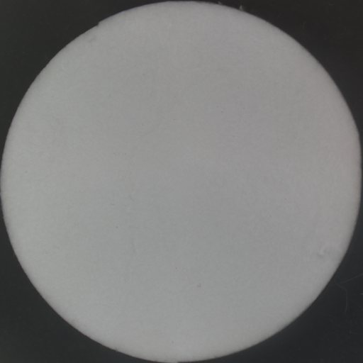
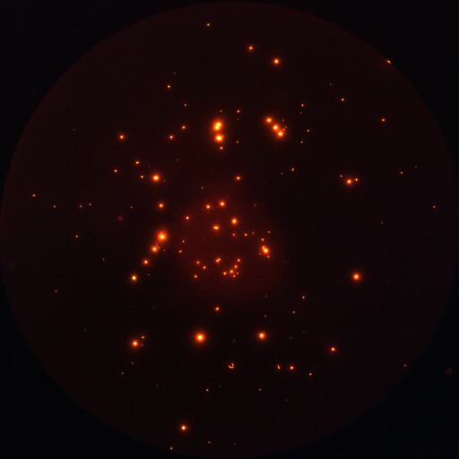

**** This GitHub page is not activated yet; this GitHub page is only used for testing at the moment. We will make this GitHub page publicly available after July 1st. ****

## Nile-red (microscophic) microplastic images

Reference [@fig:subfigures (a)], or [@fig:subfigures] (a), or @fig:subfigures (b)

## Citation 

Readers may use the following information to cite our research and the dataset.

Baek, J. Y., de Guzman, M. K., Park, H. M., Park, S., Shin, B., Velickovic, T. C., ... & De Neve, W. (2021). Developing a Segmentation Model for Microscopic Images of Microplastics Isolated from Clams. In Pattern Recognition. ICPR International Workshops and Challenges (pp. 86-97). Springer International Publishing.

##### The original paper can be found at the following URL

https://www.springerprofessional.de/en/developing-a-segmentation-model-for-microscopic-images-of-microp/18900224
