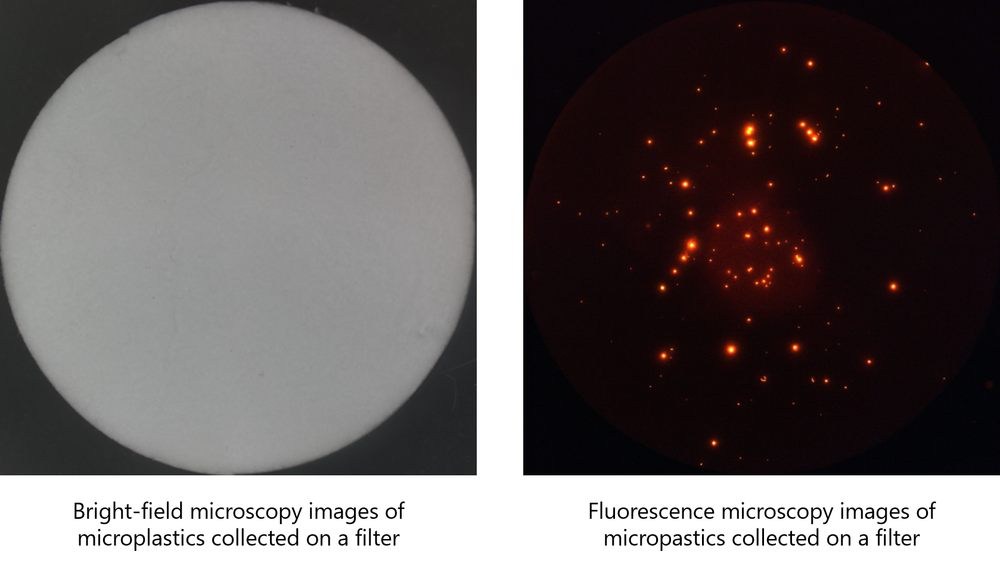

**** This GitHub page is not activated yet; this GitHub page is only used for testing at the moment. We will make this GitHub page publicly available after July 1st. ****

## Images of Nile red-stained microplastics

## Microplastics

Microplastics are small pieces of synthetic polymers that are less than 5 mm. They mainly come from tiny plastics used in manufacturing of commercial products (such as cosmetics and clothing) and the breakdown of large plastic wastes. They are widespread and abundant especially in the aquatic environment. Every year, an estimated 68,500 to 275,000 tons of microplastics end up in our oceans.

## Nile red staining and quantification of microplastics

Through Nile red staining, microplastics can be easily visualized under a fluorescence microscope. 
The microscopic image could be captured and microplastics can be quantified by manually counting the number of fluorescent items in the image or through the use of image processing software. Since manual counting is time-consuming, prone to bias, and prone to error, other means of automated quantification is being explored.

## Nile red-stained microplastics (This dataset)

Using Nile red, pieces of HDPE (high-density polyethylene, 500 μm) and PET (polyethylene terephthalate, 120 μm) were stained and subsequently visualized through fluorescence microscopy. A total of 5 different images were generated and used to calculate for the recovery rate.    

1. Normal mircoscophic images 
2. Fluorescence mircoscophic images 
3. Annotated images
   * MP-VAT
   * MP-ACT
   * Human annotation (3 annotators)

## Download 

https://drive.google.com/file/d/1rp_0MWLvvPSEFLEzzRToU0G1P9VEYukW/view?usp=sharing

## Citation 

Readers may use the following information to cite our research and the dataset.

Baek, J. Y., de Guzman, M. K., Park, H. M., Park, S., Shin, B., Velickovic, T. C., ... & De Neve, W. (2021). Developing a Segmentation Model for Microscopic Images of Microplastics Isolated from Clams. In Pattern Recognition. ICPR International Workshops and Challenges (pp. 86-97). Springer International Publishing.

##### The original paper can be found at the following URL

https://www.springerprofessional.de/en/developing-a-segmentation-model-for-microscopic-images-of-microp/18900224
